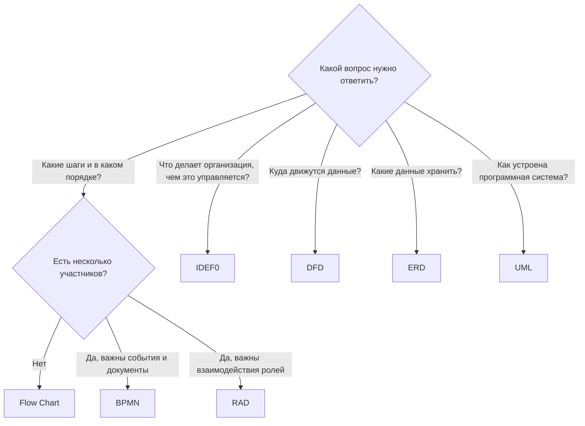

# Сравнение и выбор нотации

## Что показывает каждая нотация

| Нотация | Порядок шагов | Решения | Роли | Взаимодействия | Данные | Управление и ресурсы | События и время |
|---|:---:|:---:|:---:|:---:|:---:|:---:|:---:|
| Flow Chart | ● | ● | – | – | ◐ | – | – |
| DFD | – | – | ◐ | – | ● | – | – |
| RAD | ● | ● | ● | ● | – | – | ◐ |
| IDEF0 | ◐ | – | ◐ | – | ◐ | ● | – |
| ERD | – | – | – | – | ● | – | – |
| UML (деятельность, последовательность, состояния) | ● | ● | ● | ● | ◐ | – | ◐ |
| BPMN | ● | ● | ● | ● | ◐ | – | ● |

● – основное назначение, ◐ – частично, – – не отображается.

## Сводная характеристика

| Нотация | Уровень | Аудитория | Стандарт | Сложность освоения |
|---|---|---|---|---|
| Flow Chart | алгоритм, простой процесс | все | ISO 5807, ГОСТ 19.701-90 | низкая |
| DFD | информационная система | аналитики | нет единого (Йордон – Демарко, Гейн – Сарсон) | низкая |
| RAD | взаимодействие ролей | аналитики процессов | методология М. Оулда | средняя |
| IDEF0 | функции организации | руководители, аналитики | FIPS PUB 183 | средняя |
| ERD | данные | аналитики, разработчики БД | нотации Чена, IDEF1X | средняя |
| UML | программная система | аналитики, разработчики | ISO/IEC 19505 | высокая |
| BPMN | сквозной бизнес-процесс | бизнес и ИТ | ISO/IEC 19510 | средняя – высокая |

## Как выбрать

## Рекомендуемая связка для проекта автоматизации

На примере платформы «ЛогиХаб»:

1. **IDEF0** – верхнеуровневая карта функций компании: что автоматизируем и какими правилами это ограничено.
2. **BPMN** – детальная модель выбранного процесса с ролями, решениями, событиями и документами.
3. **DFD** – какие данные передаются между процессами и где хранятся.
4. **ERD** – структура базы данных автоматизируемой системы.
5. **UML** – диаграммы последовательности и состояний для разработки (например, Telegram-бота).
6. **Flow Chart** – инструкции для пользователей и алгоритмы отдельных функций.

!!! tip "Главный вывод"
    Универсальной нотации нет: каждая хорошо отвечает на свой вопрос. Для бизнес-процессов
    основой служит BPMN, а остальные нотации дополняют её взглядом на функции, данные и программную систему.
