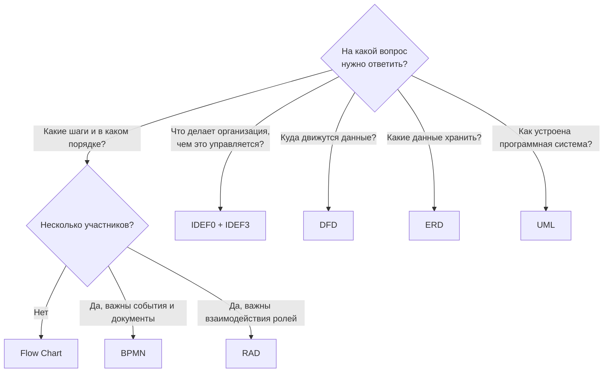

# Сравнение и выбор нотации

## Подберите нотацию под свой вопрос

  

    <button type="button" data-n="fc">Какие шаги и в каком порядке?</button>
    <button type="button" data-n="bpmn">Кто, что и когда делает в сквозном процессе?</button>
    <button type="button" data-n="rad">Как роли передают друг другу работу?</button>
    <button type="button" data-n="idef">Что делает организация и чем это управляется?</button>
    <button type="button" data-n="dfd">Откуда и куда движутся данные?</button>
    <button type="button" data-n="erd">Какие данные хранить в базе?</button>
    <button type="button" data-n="uml">Как устроена программная система?</button>
  

  

Выберите вопрос – и wiki подскажет нотацию.

  <template data-n="fc">
<b class="lh-ans__n">Flow Chart</b>

Блок-схема – порядок шагов и решения, понятна без подготовки.

<a href="../notations/flowchart/">Открыть раздел →</a>

</template>
  <template data-n="bpmn">
<b class="lh-ans__n">BPMN</b>

Пулы и дорожки, события, шлюзы и документы – стандарт для сквозных процессов.

<a href="../notations/bpmn/">Открыть раздел →</a>

</template>
  <template data-n="rad">
<b class="lh-ans__n">RAD</b>

Роли, их действия и взаимодействия – видно каждую передачу работы.

<a href="../notations/rad/">Открыть раздел →</a>

</template>
  <template data-n="idef">
<b class="lh-ans__n">IDEF0</b>

Функции со входами, выходами, управлением и механизмами; порядок работ – IDEF3.

<a href="../notations/idef/">Открыть раздел →</a>

</template>
  <template data-n="dfd">
<b class="lh-ans__n">DFD</b>

Процессы, хранилища, внешние сущности и потоки данных между ними.

<a href="../notations/dfd/">Открыть раздел →</a>

</template>
  <template data-n="erd">
<b class="lh-ans__n">ERD</b>

Сущности, атрибуты, ключи и кардинальность связей – основа базы данных.

<a href="../notations/erd/">Открыть раздел →</a>

</template>
  <template data-n="uml">
<b class="lh-ans__n">UML</b>

Диаграммы деятельности, последовательности, состояний и классов для разработчиков.

<a href="../notations/uml/">Открыть раздел →</a>

</template>

## Что показывает каждая нотация

Наведите курсор на столбец, чтобы сравнить нотации по одному признаку.

| Нотация | Порядок шагов | Решения | Роли | Взаимодействия | Данные | Управление и ресурсы | События и время |
|---|:---:|:---:|:---:|:---:|:---:|:---:|:---:|
| Flow Chart | ● | ● | – | – | ◐ | – | – |
| DFD | – | – | ◐ | – | ● | – | – |
| RAD | ● | ● | ● | ● | – | – | ◐ |
| IDEF0 / IDEF3 | ◐ | ◐ | ◐ | – | ◐ | ● | – |
| ERD | – | – | – | – | ● | – | – |
| UML (деятельность, последовательность, состояния) | ● | ● | ● | ● | ◐ | – | ◐ |
| BPMN | ● | ● | ● | ● | ◐ | – | ● |

● – основное назначение, ◐ – частично, – – не отображается.

## Сводная характеристика

| Нотация | Уровень | Аудитория | Стандарт | Сложность освоения |
|---|---|---|---|---|
| Flow Chart | алгоритм, простой процесс | все | ISO 5807, ГОСТ 19.701-90 | низкая |
| DFD | информационная система | аналитики | нет единого (Йордон – Демарко, Гейн – Сарсон) | низкая |
| RAD | взаимодействие ролей | аналитики процессов | методология М. Оулда | средняя |
| IDEF0 / IDEF3 | функции и сценарии организации | руководители, аналитики | FIPS PUB 183 | средняя |
| ERD | данные | аналитики, разработчики БД | нотации Чена, IDEF1X (FIPS PUB 184) | средняя |
| UML | программная система | аналитики, разработчики | ISO/IEC 19505 | высокая |
| BPMN | сквозной бизнес-процесс | бизнес и ИТ | ISO/IEC 19510 | средняя – высокая |

## Как выбрать

## Рекомендуемая связка для проекта автоматизации

На примере платформы «ЛогиХаб»:

1. **IDEF0** – верхнеуровневая карта функций компании: что автоматизируем и какими правилами это ограничено.
2. **BPMN** – детальная модель выбранного процесса с ролями, решениями, событиями и документами.
3. **DFD** – какие данные передаются между процессами и где хранятся.
4. **ERD** – структура базы данных автоматизируемой системы.
5. **UML** – диаграммы последовательности и состояний для разработки (например, Telegram-бота).
6. **Flow Chart** – инструкции для пользователей и алгоритмы отдельных функций.

!!! tip "Главный вывод"
    Универсальной нотации нет: каждая хорошо отвечает на свой вопрос. Для бизнес-процессов
    основой служит BPMN, а остальные нотации дополняют её взглядом на функции, данные и программную систему.
