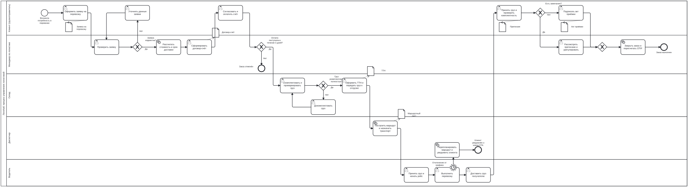

---
hide:
  - toc
---

# BPMN – нотация моделирования бизнес-процессов

Появилась<b>2004; версия 2.0 – 2011, OMG</b>

Стандарт<b>ISO/IEC 19510</b>

Отвечает на вопрос<b>Кто, что, в каком порядке и при каких событиях?</b>

Сложность<b>средняя – высокая</b>

## Описание

**BPMN (Business Process Model and Notation)** – стандарт консорциума **OMG** для графического
описания бизнес-процессов. Версия **2.0** (2011) [[6]](../sources.md#src-6) соответствует ISO/IEC 19510 и определяет не
только обозначения, но и XML-формат обмена моделями, поэтому диаграммы переносятся между
инструментами и могут исполняться BPM-движками. Нотация создавалась так, чтобы её одинаково
понимали бизнес-аналитики, разработчики и участники процесса.

**Когда применять:** описание сквозных бизнес-процессов с несколькими участниками, решениями,
событиями и документами; подготовка процесса к автоматизации.

**Ограничения:** большое число элементов требует обучения; структуру данных и архитектуру
системы нотация не описывает.

## Элементы нотации

| Категория | Элементы | Обозначение |
|---|---|---|
| События | стартовое, промежуточное, конечное; таймер, сообщение, ошибка | круги с тонкой, двойной и толстой границей, значок типа внутри |
| Действия | задача (пользовательская, сервисная, ручная), подпроцесс | скруглённый прямоугольник, значок типа в углу |
| Шлюзы | исключающий (XOR), параллельный (AND), включающий (OR), по событиям | ромб со значком «X», «+», «O» |
| Потоки | поток операций, поток сообщений, ассоциация | сплошная стрелка, пунктир с кружком, пунктир |
| Зоны ответственности | пул, дорожка | прямоугольник, разделённый на полосы |
| Данные и артефакты | объект данных, хранилище, группа, аннотация | лист с загнутым углом, цилиндр, пунктирная рамка, скобка |

## Правила составления

1. У процесса есть стартовое и конечное события; процесс читается слева направо [[4]](../sources.md#src-4).
2. Задачи называются «глагол + объект», события – состоянием, шлюзы – вопросом с подписанными ветвями.
3. Поток операций не пересекает границу пула; взаимодействие пулов – потоками сообщений.
4. Ветви, разделённые шлюзом, сводятся шлюзом того же типа или завершаются своими событиями.
5. Документы изображаются объектами данных, связанными с задачами.
6. Сложные фрагменты сворачиваются в подпроцессы, чтобы диаграмма оставалась читаемой.

## Пример: процесс управления логистикой

Модель с пятью дорожками, 26 этапами, шлюзами, событием-таймером и документами. Это настоящий
файл BPMN 2.0, открытый движком bpmn-js [[5]](../sources.md#src-5): модель можно масштабировать
колесом, перемещать мышью, а кнопка **«▶ Пройти процесс»** проводит по основному пути процесса шаг за шагом.
Исходный файл – [logistics_process.bpmn](../assets/logistics_process.bpmn); полное описание этапов –
в [Wiki продукта «ЛогиХаб»](https://starpxand.github.io/logihub-wiki/process/).

!!! note "Что видно и чего не видно"
    BPMN объединяет сильные стороны остальных нотаций для процессов: как Flow Chart – порядок и
    решения, как RAD – роли и передачи между ними, дополнительно – события (таймер задержки) и
    документы. Структуру базы данных и функциональную декомпозицию лучше описывать ERD и IDEF0.

## Ссылки

1. Business Process Model and Notation (BPMN). Version 2.0 / Object Management Group. – Needham, 2011. – 538 p. – URL: <https://www.omg.org/spec/BPMN/2.0/> (дата обращения: 07.10.2026).
2. BPMN 2.0 Symbols – A complete guide with examples // Camunda : сайт. – URL: <https://camunda.com/bpmn/reference/> (дата обращения: 07.10.2026).
3. bpmn.io : web-based tooling for BPMN, DMN, CMMN, and Forms : сайт. – URL: <https://bpmn.io> (дата обращения: 07.10.2026).
