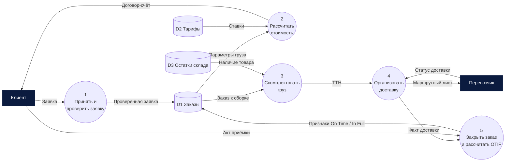

# DFD – диаграмма потоков данных

## Описание

**DFD (Data Flow Diagram)** показывает, как данные поступают в систему из внешнего мира,
как преобразуются процессами, где хранятся и куда передаются. Нотация развита в рамках
методов структурного анализа 1970-х годов (**Т. Демарко, Э. Йордон**; **К. Гейн и Т. Сарсон**).

Диаграммы строятся **иерархически**: контекстная диаграмма показывает всю систему одним
процессом и её внешние сущности, диаграммы следующих уровней раскрывают процессы.

**Когда применять:** анализ информационных потоков, проектирование информационной системы,
поиск дублирования данных и лишних передач.

**Ограничения:** не показывает последовательность во времени, условия и ответственных за шаги.

## Элементы нотации

| Элемент | Йордон – Демарко | Гейн – Сарсон | Назначение |
|---|---|---|---|
| Внешняя сущность | прямоугольник | прямоугольник с тенью | источник или получатель данных вне системы |
| Процесс | круг | скруглённый прямоугольник с номером | преобразование входных данных в выходные |
| Хранилище данных | две параллельные линии | открытый справа прямоугольник с номером D1… | данные, сохраняемые для последующего использования |
| Поток данных | стрелка с названием | стрелка с названием | перемещение данных |

## Правила составления

1. Каждый процесс имеет хотя бы один входной и один выходной поток; процесс называется глаголом («Проверить заявку»).
2. Поток данных всегда проходит через процесс: нельзя соединять две внешние сущности, два хранилища или сущность с хранилищем напрямую.
3. Потоки подписываются существительными – названиями данных («Заявка», «Счёт»).
4. **Балансировка уровней:** входы и выходы процесса на верхнем уровне совпадают с внешними потоками его декомпозиции.
5. Процессы нумеруются иерархически: 1, 1.1, 1.2…
6. На диаграмме не показываются управляющие потоки и условия – только данные.

## Пример: диаграмма уровня 1 для обработки заказа

!!! note "Что видно и чего не видно"
    DFD отвечает на вопрос «какие данные нужны и где они хранятся»: видно, что расчёт стоимости
    опирается на хранилище тарифов, а KPI OTIF формируется при закрытии заказа. Порядок шагов и
    условия (например, «заявка некорректна») на DFD не показываются.

## Ссылки

- Data flow diagram // Wikipedia. – URL: <https://en.wikipedia.org/wiki/Data-flow_diagram>
- Yourdon E. Modern Structured Analysis. – Prentice Hall, 1989. – 672 p.
- What is a Data Flow Diagram // Lucidchart. – URL: <https://www.lucidchart.com/pages/data-flow-diagram>
