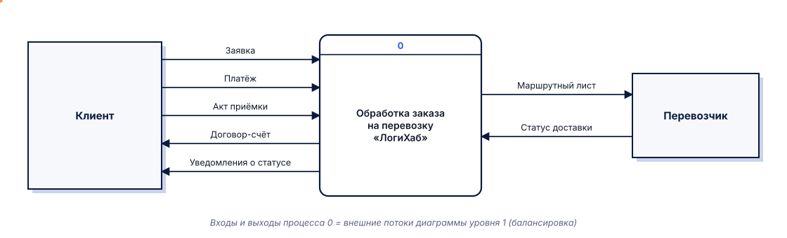
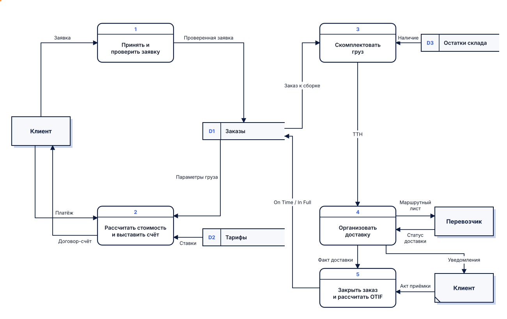

# DFD – диаграмма потоков данных

Появилась<b>1970-е, структурный анализ</b>

Авторы нотаций<b>Йордон – Демарко, Гейн – Сарсон</b>

Отвечает на вопрос<b>Откуда и куда движутся данные?</b>

Сложность<b>низкая</b>

## Описание

**DFD (Data Flow Diagram)** показывает, как данные поступают в систему из внешнего мира,
как преобразуются процессами, где хранятся и куда передаются. Нотация развита в рамках
методов структурного анализа 1970-х годов: варианты обозначений предложили **Э. Йордон и Т. Демарко**
[[21]](../sources.md#src-21) и **К. Гейн и Т. Сарсон** [[9]](../sources.md#src-9).

Диаграммы строятся **иерархически**: контекстная диаграмма показывает всю систему одним
процессом и её внешние сущности, диаграммы следующих уровней раскрывают процессы [[8]](../sources.md#src-8).

**Когда применять:** анализ информационных потоков, проектирование информационной системы,
поиск дублирования данных и лишних передач.

**Ограничения:** не показывает последовательность во времени, условия и ответственных за шаги.

## Элементы нотации

| Элемент | Йордон – Демарко | Гейн – Сарсон | Назначение |
|---|---|---|---|
| Внешняя сущность | прямоугольник | прямоугольник с тенью; дубликат – с косой чертой в углу | источник или получатель данных вне системы |
| Процесс | круг | скруглённый прямоугольник с номером в верхней части | преобразование входных данных в выходные |
| Хранилище данных | две параллельные линии | прямоугольник, открытый справа, с номером D1, D2… | данные, сохраняемые для последующего использования |
| Поток данных | стрелка с названием | стрелка с названием | перемещение данных |

## Правила составления

1. Каждый процесс имеет хотя бы один входной и один выходной поток; процесс называется глаголом («Проверить заявку»).
2. Поток данных всегда проходит через процесс: нельзя соединять две внешние сущности, два хранилища или сущность с хранилищем напрямую.
3. Потоки подписываются существительными – названиями данных («Заявка», «Счёт»).
4. **Балансировка уровней:** входы и выходы процесса на верхнем уровне совпадают с внешними потоками его декомпозиции.
5. Процессы нумеруются иерархически: 1, 1.1, 1.2…
6. На диаграмме не показываются управляющие потоки и условия – только данные.
7. Чтобы избежать пересечения линий, внешнюю сущность можно изобразить повторно – дубликат помечается косой чертой.

## Пример: обработка заказа в нотации Гейна – Сарсона

**Контекстная диаграмма (уровень 0)** – вся система одним процессом и её окружение:

**Диаграмма уровня 1** – декомпозиция процесса 0. Внешние потоки совпадают с контекстной
диаграммой (балансировка); оранжевые точки показывают движение данных по потокам.

!!! note "Что видно и чего не видно"
    DFD отвечает на вопрос «какие данные нужны и где они хранятся»: видно, что расчёт стоимости
    опирается на хранилище тарифов, а признаки On Time и In Full записываются в заказ при его закрытии.
    Порядок шагов и условия (например, «заявка некорректна») на DFD не показываются.

## Ссылки

1. Gane, C. Structured Systems Analysis : Tools and Techniques / C. Gane, T. Sarson. – Englewood Cliffs : Prentice-Hall, 1979. – 241 p.
2. Yourdon, E. Modern Structured Analysis / E. Yourdon. – Englewood Cliffs : Yourdon Press, 1989. – 672 p.
3. Data-flow diagram // Wikipedia : the free encyclopedia : сайт. – URL: <https://en.wikipedia.org/wiki/Data-flow_diagram> (дата обращения: 07.10.2026).
4. What Is a Data Flow Diagram? Symbols and Examples // Lucid : сайт. – URL: <https://www.lucidchart.com/pages/data-flow-diagram> (дата обращения: 07.10.2026).
