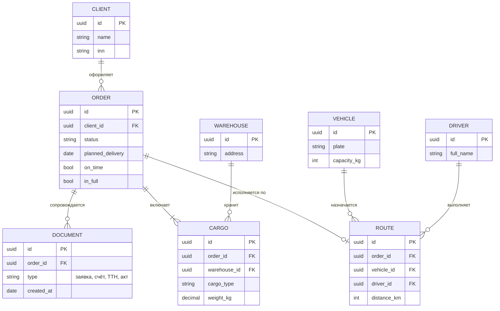

# ERD – модель «сущность – связь»

## Описание

**ERD (Entity-Relationship Diagram)** описывает **структуру данных** предметной области:
объекты (сущности), их характеристики (атрибуты) и связи между ними. Модель предложена
**П. Ченом** в 1976 году. Сегодня распространены нотации Чена (концептуальное
моделирование) и **«воронья лапка»** (Crow's Foot) Г. Эверета, а также IDEF1X – для
логических и физических моделей баз данных.

В моделировании бизнес-процессов ERD отвечает на вопрос, **о каких объектах процесс хранит
информацию**, и служит основой для проектирования базы данных автоматизируемой системы.

**Когда применять:** проектирование базы данных, согласование терминов предметной области,
анализ информационных объектов процесса.

**Ограничения:** не описывает действия, последовательность и участников процесса.

## Элементы нотации

| Элемент | Нотация Чена | «Воронья лапка» | Назначение |
|---|---|---|---|
| Сущность | прямоугольник | прямоугольник со списком атрибутов | класс объектов: Клиент, Заказ |
| Атрибут | овал | строка внутри сущности | свойство сущности |
| Первичный ключ | подчёркнутый атрибут | отметка PK | уникальный идентификатор экземпляра |
| Связь | ромб | линия между сущностями | отношение между сущностями |
| Кардинальность | 1, N, M у линий | концы линии: черта – «один», «лапка» – «много», кружок – «необязательно» | сколько экземпляров участвует в связи |

## Правила составления

1. Сущности называются существительными в единственном числе.
2. У каждой сущности определяется первичный ключ.
3. Для каждой связи указываются кардинальность (1:1, 1:N, M:N) и обязательность участия.
4. Связи «многие ко многим» на логическом уровне разрешаются промежуточной сущностью.
5. Модель нормализуется (как правило, до третьей нормальной формы) – каждый факт хранится в одном месте.
6. Вычисляемые значения (например, итоговая стоимость) не дублируются без необходимости.

## Пример: данные процесса обработки заказа

!!! note "Что видно и чего не видно"
    ERD показывает, что один клиент оформляет много заказов, заказ включает одно или несколько
    грузовых мест и сопровождается документами, а признаки On Time и In Full хранятся в заказе.
    Как и когда эти данные появляются, по диаграмме понять нельзя.

## Ссылки

- Chen P. P. The Entity-Relationship Model – Toward a Unified View of Data // ACM Transactions on Database Systems. – 1976. – Vol. 1, № 1. – P. 9–36.
- Entity relationship diagram syntax // Mermaid. – URL: <https://mermaid.js.org/syntax/entityRelationshipDiagram.html>
- What is an Entity Relationship Diagram // Lucidchart. – URL: <https://www.lucidchart.com/pages/er-diagrams>
