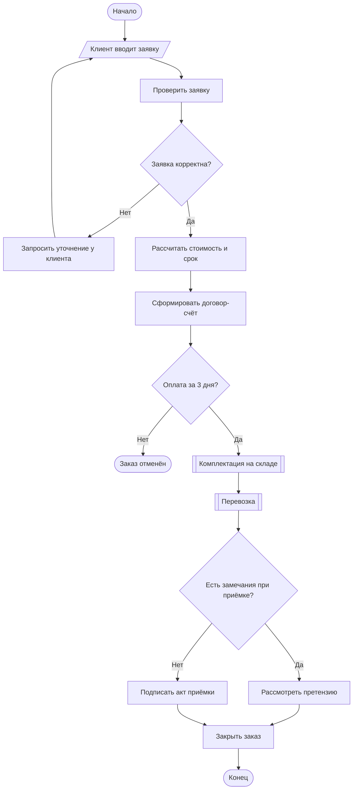

# Flow Chart – блок-схема

## Описание

**Блок-схема (Flow Chart)** – графическое представление алгоритма или процесса в виде
последовательности блоков, соединённых линиями потока. Нотация появилась в 1920-х годах
(«flow process chart» Ф. и Л. Гилбрет) и стала стандартом для описания алгоритмов.
Обозначения закреплены международным стандартом **ISO 5807:1985** и соответствующим ему
**ГОСТ 19.701-90** «Схемы алгоритмов, программ, данных и систем».

**Когда применять:** описание простого линейного процесса или алгоритма с ветвлениями,
инструкции для сотрудников, объяснение логики для неподготовленной аудитории.

**Ограничения:** не показывает, кто выполняет шаг, и плохо масштабируется на процессы с
несколькими участниками и параллельной работой.

## Элементы нотации

| Элемент | Обозначение | Назначение |
|---|---|---|
| Терминатор | овал (скруглённый прямоугольник) | начало и конец процесса |
| Процесс | прямоугольник | действие, операция |
| Решение | ромб | проверка условия, один вход и два или более выхода |
| Данные | параллелограмм | ввод или вывод данных |
| Предопределённый процесс | прямоугольник с двойными боковыми линиями | ранее описанный подпроцесс |
| Документ | прямоугольник с волнистым нижним краем | бумажный или электронный документ |
| Соединитель | круг | разрыв линии, переход на другую часть схемы |
| Линия потока | линия (со стрелкой при нестандартном направлении) | порядок выполнения |

## Правила составления

1. Схема имеет одну точку начала и хотя бы одну точку окончания.
2. Основное направление – сверху вниз и слева направо; стрелки ставятся, если поток идёт в обратном направлении.
3. У блока «Решение» каждый выход подписывается («Да» / «Нет» или значение условия).
4. Текст в блоках – кратко, в повелительном наклонении («Проверить заявку»).
5. Линии не должны пересекаться без необходимости; для длинных связей используются соединители.
6. Сложные фрагменты выносятся в отдельные схемы и показываются блоком «Предопределённый процесс».

## Пример: обработка заявки на перевозку

!!! note "Что видно и чего не видно"
    Блок-схема хорошо показывает порядок шагов и точки принятия решений, но из неё нельзя
    понять, какой шаг выполняет клиент, а какой – склад или менеджер.

## Ссылки

- ISO 5807:1985. Information processing – Documentation symbols and conventions for data, program and system flowcharts. – URL: <https://www.iso.org/standard/11955.html>
- What is a Flowchart // Lucidchart. – URL: <https://www.lucidchart.com/pages/what-is-a-flowchart-tutorial>
- Flowchart syntax // Mermaid. – URL: <https://mermaid.js.org/syntax/flowchart.html>
