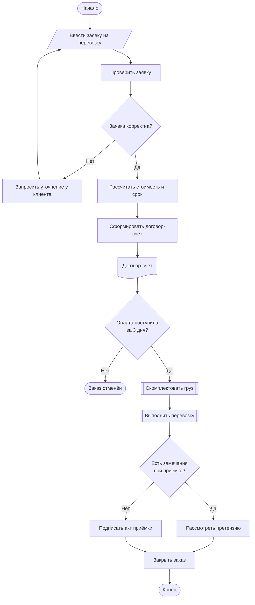

# Flow Chart – блок-схема

Появилась<b>1921, Ф. и Л. Гилбрет</b>

Стандарт<b>ISO 5807, ГОСТ 19.701-90</b>

Отвечает на вопрос<b>Какие шаги и в каком порядке?</b>

Сложность<b>низкая</b>

## Описание

**Блок-схема (Flow Chart)** – графическое представление алгоритма или процесса в виде
последовательности блоков, соединённых линиями потока. Прообраз нотации – «flow process chart»
Ф. и Л. Гилбрет (1921); позже блок-схемы стали стандартом описания алгоритмов. Обозначения закреплены
международным стандартом **ISO 5807:1985** [[13]](../sources.md#src-13) и соответствующим ему
**ГОСТ 19.701-90** «Схемы алгоритмов, программ, данных и систем» [[1]](../sources.md#src-1).

**Когда применять:** описание простого линейного процесса или алгоритма с ветвлениями,
инструкции для сотрудников, объяснение логики для неподготовленной аудитории [[19]](../sources.md#src-19).

**Ограничения:** не показывает, кто выполняет шаг, и плохо масштабируется на процессы с
несколькими участниками и параллельной работой.

## Элементы нотации

| Элемент | Обозначение | Назначение |
|---|---|---|
| Терминатор | скруглённый прямоугольник (овал) | начало и конец процесса |
| Процесс | прямоугольник | действие, операция |
| Решение | ромб | проверка условия: один вход и два или более выхода |
| Данные | параллелограмм | ввод или вывод данных |
| Предопределённый процесс | прямоугольник с двойными боковыми линиями | ранее описанный подпроцесс |
| Документ | прямоугольник с волнистым нижним краем | бумажный или электронный документ |
| Соединитель | круг | разрыв линии, переход на другую часть схемы |
| Линия потока | линия, стрелка – при направлении снизу вверх или справа налево | порядок выполнения |

## Правила составления

1. Схема имеет одну точку начала и хотя бы одну точку окончания.
2. Основное направление – сверху вниз и слева направо; стрелки обязательны, если поток идёт в обратном направлении [[1]](../sources.md#src-1).
3. У блока «Решение» каждый выход подписывается («Да» / «Нет» или значение условия).
4. Текст в блоках – кратко, в повелительном наклонении («Проверить заявку»).
5. Линии не должны пересекаться без необходимости; для длинных связей используются соединители.
6. Сложные фрагменты выносятся в отдельные схемы и показываются блоком «Предопределённый процесс».

## Пример: обработка заявки на перевозку

В примере использованы все основные символы: терминаторы, ввод данных, процессы, решения,
документ и предопределённые процессы (комплектация и перевозка описаны отдельными схемами).

!!! note "Что видно и чего не видно"
    Блок-схема хорошо показывает порядок шагов и точки принятия решений, но из неё нельзя
    понять, какой шаг выполняет клиент, а какой – склад или менеджер.

## Ссылки

1. ГОСТ 19.701-90 (ИСО 5807-85). Единая система программной документации. Схемы алгоритмов, программ, данных и систем. Обозначения условные и правила выполнения : межгосударственный стандарт : утв. и введен в действие Постановлением Государственного комитета СССР по управлению качеством продукции и стандартам от 26 декабря 1990 г. № 3294 : взамен ГОСТ 19.002-80, ГОСТ 19.003-80 : дата введения 1992-01-01. – Москва : Стандартинформ, 2010. – 24 с.
2. ISO 5807:1985. Information processing – Documentation symbols and conventions for data, program and system flowcharts, program network charts and system resources charts. – Geneva : International Organization for Standardization, 1985. – URL: <https://www.iso.org/standard/11955.html> (дата обращения: 07.10.2026).
3. What Is a Flowchart? Symbols, Types and Examples // Lucid : сайт. – URL: <https://www.lucidchart.com/pages/what-is-a-flowchart-tutorial> (дата обращения: 07.10.2026).
4. Mermaid : diagramming and charting tool : сайт. – URL: <https://mermaid.js.org> (дата обращения: 07.10.2026).
