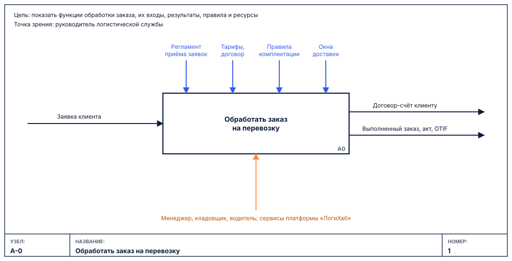
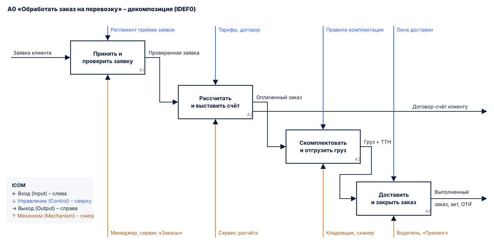
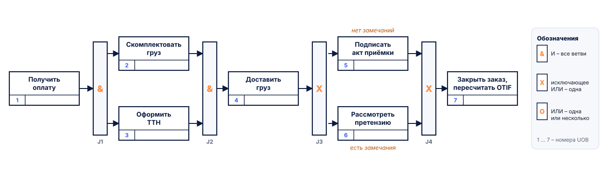

# IDEF – семейство методологий

Появилось<b>1970–1990-е, программа ICAM ВВС США</b>

Стандарты<b>FIPS PUB 183 (IDEF0), 184 (IDEF1X)</b>

Отвечает на вопрос<b>Что делает организация и чем это управляется?</b>

Сложность<b>средняя</b>

## Описание

**IDEF (Integration Definition)** – семейство методологий моделирования, разработанное в
рамках программы ВВС США ICAM в 1970–1990-х годах. Для бизнес-процессов используются три методологии:

| Стандарт | Что моделирует | Основа |
|---|---|---|
| **IDEF0** | функции системы, их входы, выходы, управление и ресурсы | метод SADT Д. Росса; FIPS PUB 183 [[11]](../sources.md#src-11) |
| **IDEF1X** | структуру данных (реляционная модель) | FIPS PUB 184 [[12]](../sources.md#src-12) |
| **IDEF3** | сценарии и последовательность работ, логику ветвления | метод описания процессов с перекрёстками [[10]](../sources.md#src-10) |

Основная нотация для бизнес-процессов – **IDEF0**: функциональная модель «сверху вниз». Когда нужно
показать порядок работ и ветвления, к ней добавляют **IDEF3**; структуру данных описывает IDEF1X
(родственная ERD, см. раздел [ERD](erd.md)).

**Когда применять:** описание деятельности организации на верхнем уровне, анализ того, что
управляет функцией и какими ресурсами она выполняется, регламентация процессов.

**Ограничения:** IDEF0 не показывает время и последовательность выполнения (порядок блоков –
условный), условия ветвления и роли в явном виде; для этого используется IDEF3.

## Элементы нотации IDEF0

| Элемент | Обозначение | Назначение |
|---|---|---|
| Функциональный блок | прямоугольник с номером (A1, A2…) в правом нижнем углу | функция, названная глаголом |
| Вход (Input) | стрелка, входящая слева | то, что преобразуется функцией |
| Управление (Control) | стрелка, входящая сверху | правила, регламенты, стандарты, ограничения |
| Выход (Output) | стрелка, выходящая справа | результат функции |
| Механизм (Mechanism) | стрелка, входящая снизу | исполнители и ресурсы: люди, системы, оборудование |
| Контекстная диаграмма A-0 | один блок, цель и точка зрения модели | граница модели |
| Рамка диаграммы | поля «Узел», «Название», «Номер» | привязка диаграммы к иерархии модели |

Четыре типа стрелок сокращённо называют **ICOM** (Input, Control, Output, Mechanism).

## Элементы нотации IDEF3

| Элемент | Обозначение | Назначение |
|---|---|---|
| Единица работы (UOB) | прямоугольник с номером в нижнем левом поле | действие или процесс сценария |
| Связь предшествования | сплошная стрелка | работа-источник завершается до начала работы-приёмника |
| Перекрёсток «И» | прямоугольник со знаком **&** | все ветви выполняются (разветвление) или все должны завершиться (слияние) |
| Перекрёсток «исключающее ИЛИ» | прямоугольник со знаком **X** | выполняется ровно одна ветвь |
| Перекрёсток «ИЛИ» | прямоугольник со знаком **O** | выполняется одна или несколько ветвей |
| Объект ссылки | прямоугольник с типом ссылки | ссылка на другую диаграмму, объект или примечание |

## Правила составления

1. Модель IDEF0 начинается с контекстной диаграммы **A-0**, где указываются цель моделирования и точка зрения [[11]](../sources.md#src-11).
2. Каждый блок декомпозируется на **3–6** блоков следующего уровня; нумерация иерархическая: A0 → A1…A4 → A11…
3. У каждого блока IDEF0 обязательно есть **управление и выход**; вход может отсутствовать.
4. Блоки располагаются «лестницей» по диагонали в порядке доминирования – сверху слева самый важный.
5. Названия функций – глаголом, стрелок – существительными; граничные стрелки дочерней диаграммы соответствуют стрелкам родительского блока.
6. В IDEF3 каждое разветвление закрывается перекрёстком того же типа; у UOB – уникальный номер.

## Пример: функция «Обработать заказ на перевозку»

**Контекстная диаграмма A-0** – граница модели, цель и точка зрения:

**Диаграмма декомпозиции A0** – четыре функции; граничные стрелки совпадают со стрелками A-0:

**IDEF3** – сценарий работ «от оплаты до закрытия заказа» с перекрёстками «И» и «исключающее ИЛИ»:

!!! note "Что видно и чего не видно"
    IDEF0 хорошо показывает, **чем управляется и кем выполняется** каждая функция: расчёт счёта
    регулируется тарифами и договором и выполняется сервисом расчёта, доставка ограничивается
    окнами доставки. Порядок во времени и условия («есть замечания при приёмке») добавляет IDEF3.

## Ссылки

1. Integration Definition for Function Modeling (IDEF0) : Federal Information Processing Standards Publication 183 / National Institute of Standards and Technology. – Gaithersburg, 1993. – URL: <https://nvlpubs.nist.gov/nistpubs/Legacy/FIPS/fipspub183.pdf> (дата обращения: 07.10.2026).
2. Integration Definition for Information Modeling (IDEF1X) : Federal Information Processing Standards Publication 184 / National Institute of Standards and Technology. – Gaithersburg, 1993. – URL: <https://nvlpubs.nist.gov/nistpubs/Legacy/FIPS/fipspub184.pdf> (дата обращения: 07.10.2026).
3. IDEF3 – Process Description Capture Method // IDEF : Integrated DEFinition Methods : сайт. – URL: <https://www.idef.com/idef3-process-description-capture-method/> (дата обращения: 07.10.2026).
