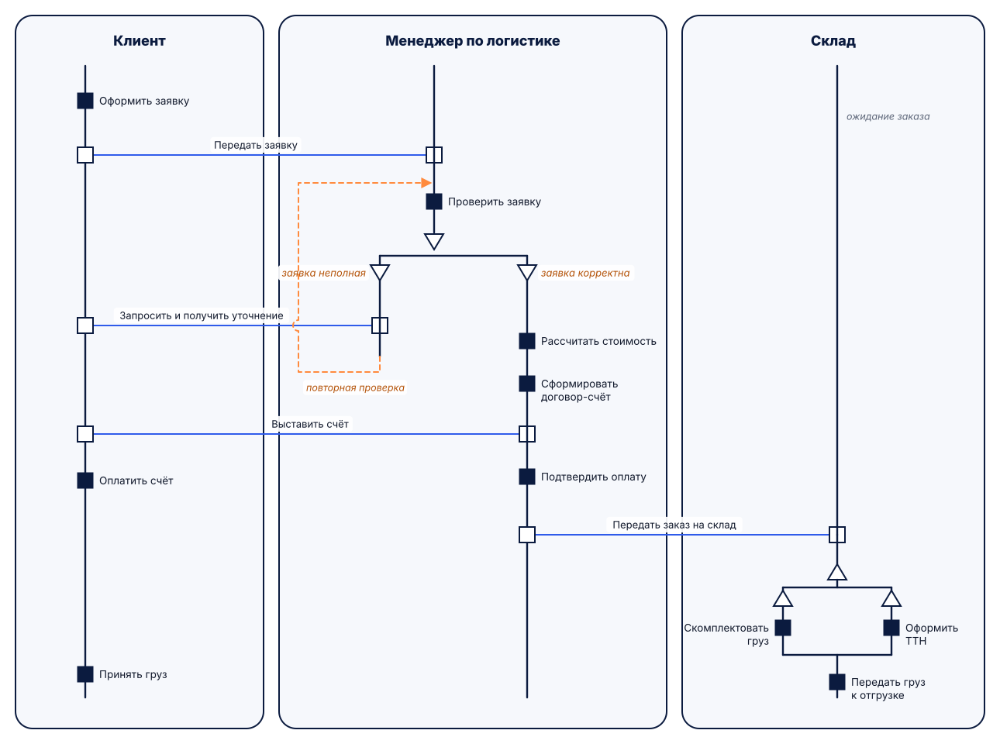

# RAD – диаграмма ролей и действий

## Описание

**RAD (Role Activity Diagram)** – нотация, в которой процесс описывается через **роли**
участников, их **действия** и **взаимодействия** между ролями. Нотация предложена
**М. Оулдом** в методе STRIM и описана в книге «Business Processes: Modelling and Analysis for
Re-engineering and Improvement» (1995). Роль – это не обязательно должность: так же
моделируются подразделения, группы и информационные системы.

**Когда применять:** процессы с большим количеством взаимодействий и согласований между
участниками, анализ обязанностей ролей, выявление лишних передач работы.

**Ограничения:** мало распространена в инструментах, не описывает данные и системную
архитектуру; большие диаграммы трудно читать.

## Элементы нотации

| Элемент | Обозначение | Назначение |
|---|---|---|
| Роль | скруглённый прямоугольник | группирует действия одного участника |
| Состояние (нить роли) | вертикальная линия | роль находится в состоянии между действиями, линия задаёт порядок |
| Действие (activity) | закрашенный квадрат | работа, которую роль выполняет самостоятельно |
| Взаимодействие (interaction) | незакрашенные квадраты, соединённые горизонтальной линией | совместное действие или передача между ролями, выполняемое одновременно всеми сторонами |
| Выбор (case refinement) | перевёрнутые треугольники с условиями | альтернативные ветви, выполняется одна из них |
| Параллельность (part refinement) | треугольники вершиной вверх | ветви выполняются независимо, в любом порядке |
| Запуск роли | перечёркнутый квадрат | создание экземпляра другой роли |
| Внешнее событие | стрелка, входящая в нить слева | ожидание события извне |

## Правила составления

1. Для каждой роли рисуется отдельная область; процесс внутри роли читается сверху вниз.
2. Действие выполняет только одна роль; всё, что требует участия двух ролей, оформляется взаимодействием.
3. Взаимодействие отображается одинаковыми незакрашенными квадратами на нитях **всех** участвующих ролей на одной горизонтали.
4. Для выбора у каждой ветви указывается условие; ветви выбора и параллельные ветви должны сходиться или завершаться.
5. Названия действий – глаголом («Проверить заявку»), взаимодействий – с точки зрения обмена («Передать заявку»).
6. Итерации показываются возвратом к предыдущему состоянию нити.

## Пример: согласование заказа между клиентом, менеджером и складом

!!! note "Что видно и чего не видно"
    RAD наглядно показывает, **сколько раз роли передают друг другу работу**: клиент
    взаимодействует с менеджером трижды (заявка, уточнение, счёт), а склад включается только
    после передачи заказа и выполняет комплектацию и оформление ТТН параллельно. Данные и
    системы, которые при этом используются, на диаграмме не видны.

## Ссылки

- Ould M. A. Business Processes: Modelling and Analysis for Re-engineering and Improvement. – John Wiley & Sons, 1995. – 224 p.
- A Guide to Role Activity Diagrams. – URL: <https://ixchelte.wordpress.com/2011/10/24/a-guide-to-role-activity-diagrams/>
- Role activity diagrams as finite state processes // ResearchGate. – URL: <https://www.researchgate.net/publication/4055431_Role_activity_diagrams_as_finite_state_processes>
