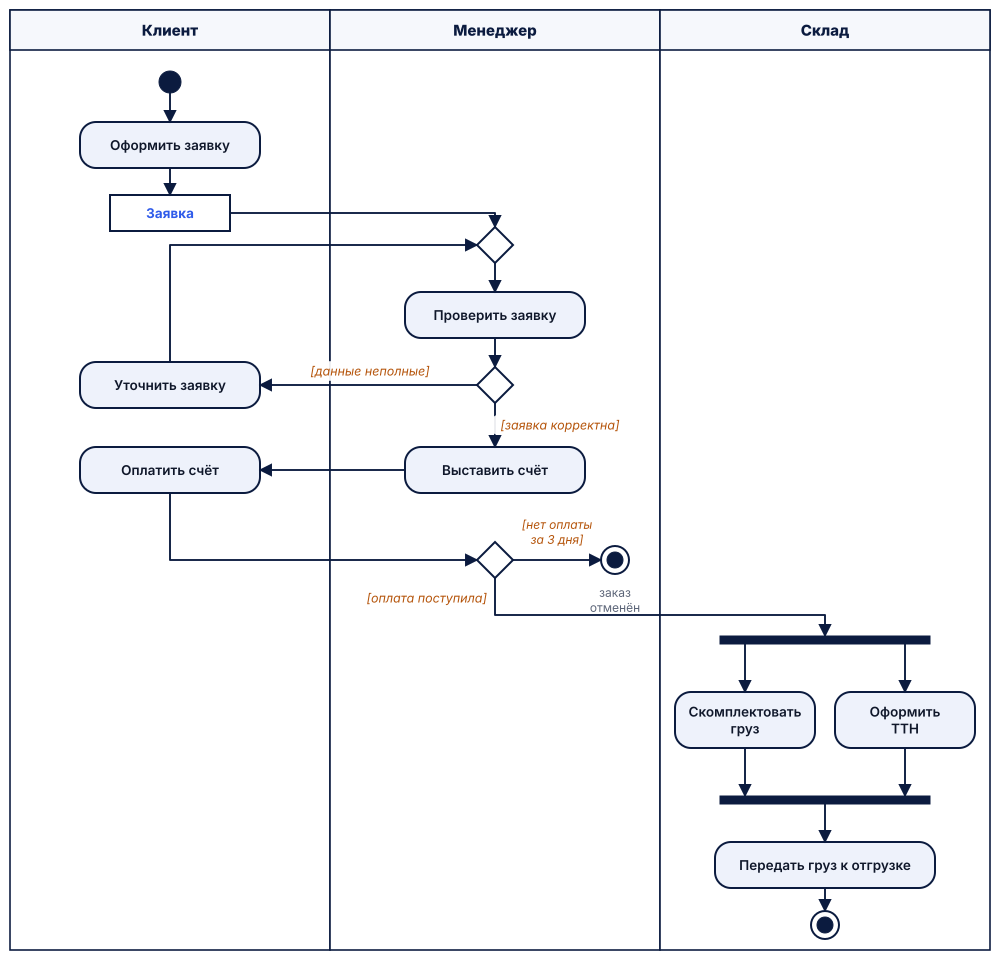

# UML – унифицированный язык моделирования

<div class="lh-stats" markdown>
<div class="lh-stat"><span>Появился</span><b>1997, OMG; версия 2.5.1 – 2017</b></div>
<div class="lh-stat"><span>Стандарт</span><b>ISO/IEC 19505</b></div>
<div class="lh-stat"><span>Отвечает на вопрос</span><b>Как устроена и ведёт себя программная система?</b></div>
<div class="lh-stat"><span>Сложность</span><b>высокая</b></div>
</div>

## Описание

**UML (Unified Modeling Language)** – графический язык для визуализации, спецификации и
документирования программных систем. Создан в 1990-х годах объединением методов **Г. Буча,
Дж. Рамбо и А. Джекобсона**, с 1997 года развивается консорциумом **OMG**; актуальная версия
– **UML 2.5.1** (2017) [[15]](../sources.md#src-15), соответствует стандарту ISO/IEC 19505.

UML 2.5 определяет **14 видов диаграмм**, разделённых на структурные (классов, компонентов,
развёртывания, объектов, пакетов, композитной структуры, профилей) и поведенческие
(деятельности, прецедентов, состояний, а также диаграммы взаимодействия – последовательности,
коммуникации, обзора взаимодействия, временная) [[2]](../sources.md#src-2).

Для бизнес-процессов чаще всего используются **диаграмма деятельности** (поток действий с
разделами-исполнителями), **диаграмма последовательности** (обмен сообщениями во времени) и
**диаграмма состояний** (жизненный цикл объекта, например заказа).

**Когда применять:** переход от описания процесса к проектированию программной системы,
общение аналитиков и разработчиков.

**Ограничения:** избыточен для бизнес-пользователей; бизнес-семантика (события, документы,
таймеры) выражается менее явно, чем в BPMN.

## Элементы нотации (диаграмма деятельности)

| Элемент | Обозначение | Назначение |
|---|---|---|
| Начальный узел | закрашенный круг | начало потока |
| Конечный узел деятельности | круг с точкой внутри | завершение всей деятельности |
| Действие | скруглённый прямоугольник | выполняемый шаг |
| Узел решения / слияния | ромб | ветвление по условию в квадратных скобках и слияние ветвей |
| Разветвитель / соединитель | толстая черта | начало и синхронизация параллельных потоков |
| Раздел (swimlane) | полоса | исполнитель действий |
| Объектный узел | прямоугольник | объект или документ, передаваемый между действиями |

## Правила составления

1. Одна диаграмма описывает одну деятельность и имеет начальный узел [[17]](../sources.md#src-17).
2. Условия на выходах узла решения записываются в квадратных скобках и взаимно исключают друг друга.
3. Параллельные ветви, открытые разветвителем, закрываются соединителем.
4. Разделы используются, если важно, **кто** выполняет действие.
5. Выбирается тот вид диаграммы, который отвечает на вопрос: поток действий – деятельность, обмен сообщениями – последовательность, жизненный цикл объекта – состояния.

## Примеры

=== "Диаграмма деятельности"

    Все элементы из таблицы: разделы «Клиент – Менеджер – Склад», объектный узел «Заявка»,
    решения с условиями, слияние, параллельная работа склада и два конечных узла.

    

=== "Диаграмма последовательности"

    ```mermaid
    sequenceDiagram
        actor К as Клиент
        participant Б as Telegram-бот
        participant З as Сервис «Заказы»
        actor М as Менеджер
        К->>Б: Новая заявка (город, груз, вес, дата)
        Б->>З: Рассчитать стоимость и срок
        З-->>Б: Стоимость, ETA
        Б-->>К: Предварительный расчёт
        К->>Б: Отправить заявку
        Б->>З: Создать заказ (status = new)
        З-->>М: Уведомление о новой заявке
        alt заявка корректна
            М->>З: Подтвердить
            З-->>К: Договор-счёт
        else данных недостаточно
            М->>З: Вернуть на уточнение
            З-->>К: Запрос уточнения
        end
    ```

=== "Диаграмма состояний заказа"

    ```mermaid
    stateDiagram-v2
        state "Новый" as New
        state "На уточнении" as Clarify
        state "Ожидает оплаты" as Confirmed
        state "Отменён" as Cancelled
        state "В пути" as Transit
        state "Задержан" as Delayed
        state "Доставлен" as Delivered
        state "Принят" as Accepted
        state "Претензия" as Claim
        state "Закрыт" as Closed
        [*] --> New
        New --> Clarify: данных недостаточно
        Clarify --> New: клиент исправил
        New --> Confirmed: заявка корректна
        Confirmed --> Cancelled: нет оплаты 3 дня
        Confirmed --> Transit: оплачен, груз отгружен
        Transit --> Delayed: отклонение от графика
        Delayed --> Delivered
        Transit --> Delivered
        Delivered --> Accepted: без замечаний
        Delivered --> Claim: есть замечания
        Accepted --> Closed
        Claim --> Closed: урегулирована
        Cancelled --> [*]
        Closed --> [*]
    ```

=== "Диаграмма классов"

    ```mermaid
    classDiagram
        class Order {
            +int id
            +str status
            +date eta
            +float price
            +set_status(status)
        }
        class Quote {
            +str destination
            +str transport
            +float price
            +date eta
        }
        class Storage {
            +create_order(client_id, quote) Order
            +set_status(order_id, status) Order
            +history(order_id)
        }
        Storage "1" --> "*" Order : хранит
        Order ..> Quote : создаётся по
    ```

!!! note "Что видно и чего не видно"
    Диаграмма деятельности показывает поток работ с исполнителями, диаграмма состояний – **жизненный
    цикл заказа**, который реализован в Telegram-боте «ЛогиХаба», а диаграмма последовательности –
    обмен сообщениями между клиентом, ботом и сервисом. Бизнес-пользователю такие диаграммы читать
    сложнее, чем BPMN.

## Ссылки

1. OMG Unified Modeling Language (OMG UML). Version 2.5.1 / Object Management Group. – Needham, 2017. – 796 p. – URL: <https://www.omg.org/spec/UML/2.5.1/> (дата обращения: 07.10.2026).
2. Фаулер, М. UML. Основы. Краткое руководство по стандартному языку объектного моделирования / М. Фаулер ; пер. с англ. А. Петухова. – 3-е изд. – Санкт-Петербург : Символ-Плюс, 2004. – 192 с.
3. UML activity diagrams // UML Diagrams : сайт. – URL: <https://www.uml-diagrams.org/activity-diagrams.html> (дата обращения: 07.10.2026).
4. Mermaid : diagramming and charting tool : сайт. – URL: <https://mermaid.js.org> (дата обращения: 07.10.2026).
